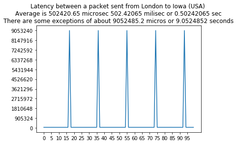

# C Socket programming

## Utils

- What sockets am I listening on: ```sudo netstat -tulpn | grep LISTEN```

## Latency analysis



## A note on file descriptors

Each running process has a file descriptor table which
contains pointers to all open i/o streams.  When a process
starts, three entries are created in the first three cells of
the table.  Entry 0 points to standard input, entry 1 points
to standard output, and entry 2 points to standard error.
Whenever a file is opened, a new entry is created in this
table, usually in the first available empty slot.

The socket system call returns an entry into this table; i.e.
a small integer.  This value is used for other calls which
use this socket.  The accept system call returns another
entry into this table.  The value returned by accept is used
for reading and writing to that connection.


## Getting started

```
: gcc -o server.tsk tcp_server.c
: gcc -o client.tsk tcp_client.c


: ./server.tsk
Starting server on port 8088
Successfully created a socket file descriptor 3.
Successfully set socket options.
Successfully bound socket fd to address & port.
Start listening in blocking mode.


: ./client.tsk
Socket successfully created.. fd: 3
connected to the server..
Enter the string :

```

## TODO
    - implement chat
    - `epoll`


## Server client model

Pseudocode:

```c
socket = socket(port, tcp)  // gives back file descr to use for read and write
bind(socket, 80)            // bind to port 80
listen(socket, 5)           // tell kernel to listen to max 5 connections
while (accept(socket))      // blocking
{

}

```

### Socket

- represented as a file (file descriptor)
- one end of a connection
- creation done with `socket()` system call
- Normally, server sockets may accept multiple client connections. Conceptually, a server socket listens on a known port. When an incoming connection arrives, the listening socket creates a new socket (the “child” socket), and establishes the connection on the child socket. The listening socket is then free to resume listening on the same port, while the child socket has an established connection with the client that is independent from its parent.

- One result of this architecture is that the listening socket never actually performs a read or write operation. It is only used to create connected sockets.

### System calls

- `socket` this system call creates a new socket = (from linux man page) creates an endpoint for communication and returns a file descriptor that refers to that endpoint.  The file descriptor returned by a successful call will be the lowest-numbered file descriptor (in the file descriptor table of the process) not currently open for the process. In our case, we pass the TCP/IP parameters to specify the type of communication this file descriptor will be used for. It takes three arguments.

  - `param:domain` The domain argument specifies a communication domain; this selects the protocol family which will be used for communication. In our case AF_INET IPv4 Internet protocols. It's the address domain of the socket. Recall that there are two possible address domains, the unix domain for two processes which share a common file system, and the Internet domain for any two hosts on the Internet. The symbol constant AF_UNIX is used for the former, and AF_INET for the latter (there are actually many other options which can be used here for specialized purposes).
  - `param:type` The socket has the indicated type, which specifies the communication semantics. Can be `SOCK_STREAM` which is sequenced, reliable, two-way, connection based byte streams (for tcp), or `SOCK_DGRAM` connectionless, unreliable messages of a fixed maximum length (for udp), or others. Can also have an extra flag `SOCK_NONBLOCK`. It's the type of socket. Recall that there are two choices here, a stream socket in which characters are read in a continuous stream as if from a file or pipe, and a datagram socket, in which messages are read in chunks. The two symbolic constants are SOCK_STREAM and SOCK_DGRAM.
  - `param:protocol` normally leave as 0. Normally only a single protocol exists to support a particular socket type within a given protocol family, in which case protocol can be specified as 0. If this argument is zero (and it always should be except for unusual circumstances), the operating system will choose the most appropriate protocol. It will choose TCP for stream sockets and UDP for datagram sockets.

```c
// sockfd: socket descriptor, an integer (like a file-handle)
// domain: integer, communication domain e.g.,
// AF_INET (IPv4 protocol) , AF_INET6 (IPv6 protocol)
// type: communication type
// SOCK_STREAM: TCP(reliable, connection oriented)
// SOCK_DGRAM: UDP(unreliable, connectionless)
// protocol: Protocol value for Internet Protocol(IP), which is 0.
// This is the same number which appears on protocol field in the IP
// header of a packet.(man protocols for more details)
int sockfd = socket(
    domain,                 // ipv4
    type,                   // tcp
    protocol)               // ip
```

- `listen` The listening socket actually begins listening at this point. It is not yet accepting connections, but the OS may accept connections on its behalf.
- A bound socket notifies the OS that it is almost ready to receive connections by listening. In spite of the term `listening`, this operation only notifies the OS that the socket is about to accept connections; it does not actually begin accepting connections, though the OS may accept a connection on behalf of the socket.
  - `param:socketfd` file descriptor of socket
  - `param:backlog` how many connections the OS may accept on behalf of the application. not the total number of active connections. It is only how many connections will be established if the application “gets behind”.


```c
// It puts the server socket in a passive mode,
// where it waits for the client to approach the server
// to make a connection. The backlog, defines the maximum length
// to which the queue of pending connections for sockfd may grow.
// If a connection request arrives when the queue is full,
// the client may receive an error with an indication of ECONNREFUSED.

int listen(
    int sockfd,     // socket file descriptor
    int backlog);   // length of queue of connections
```

```c


// This helps in manipulating options for the socket
// referred by the file descriptor sockfd.
// This is completely optional, but it helps in reuse of address and port.
// Prevents error such as: “address already in use”.

int setsockopt(
    int sockfd,             // socket file descriptor
    int level,
    int optname,
    const void *optval,
    socklen_t optlen);


// After creation of the socket, bind function binds the
// socket to the address and port number specified
// in addr(custom data structure).
// In the example code, we bind the server to the localhost,
// hence we use INADDR_ANY to specify the IP address.

int bind(
    int sockfd,                     // socket file descriptor
    const struct sockaddr *addr,    // address and port number
    socklen_t addrlen);


// It extracts the first connection request on the queue of
// pending connections for the listening socket, sockfd, creates a
// new connected socket, and returns a new file descriptor referring
// to that socket. At this point, connection is established between
// client and server, and they are ready to transfer data.
int new_socket= accept(
    int sockfd,                     // socket file descriptor
    struct sockaddr *addr,          // address
    socklen_t *addrlen);            //
```

- `connect`

```c
// Socket connection: Exactly same as that of server’s socket creation
// The connect() system call connects the socket referred to by the file
// descriptor sockfd to the address specified by addr. Server’s address
// and port is specified in addr.
int connect(
    int sockfd,
    const struct sockaddr *addr,
    socklen_t addrlen);
```